# BF2042 - Capture The Flag (mixed INF-Only & AOW)

## Experience Codes

- 2042 Version: `ABENTC`
- BF3 Version: `ABEWX7`

## Gameplay Rules

Each team is owning a capture point on which a flag is located. In total there are 5 flags stored at this capture point (represented as conquest tickets).  
The goal is to steal all the enemy flags as the first team.  
Get to the opposing flag to pick it up and carry it back to your base to score a point.  
To pick up or deliver a flag, the player must be on foot and not in a vehicle and within a 3m proximity to the flag (just walk over it).  
If the flag carrier dies, the flag will be dropped at their current location.

A dropped flag

- can be picked up by the opposing team again
- will return to its base after a timeout (default: 90 seconds)
- can be returned faster by its owning team by standing close to it (stand within 10m)

The team stealing 5 flags first, wins the match.  
In case of reaching the timelimit, the team which stole the most flags wins.

To score, the own flag must be at the base when delivering the enemy flag.

## Vehicle Restrictions

- 1x Main Battle Tank
- 1x Wildcat
- 7x Light transport Vehicles
  - 3x Hovercrafts
  - 3x LATV
  - 1x Pondhawk
- 2x Jet
- 1x Attack Helicopter
- 2x Heavy Transport Vehicle
  - 1x MAV
  - 1x CAV-Brawler

## Map Layouts

### Redacted (infantry only)

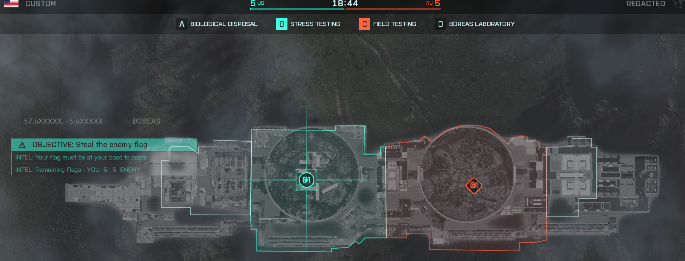

### Flashpoint (all out warfare)

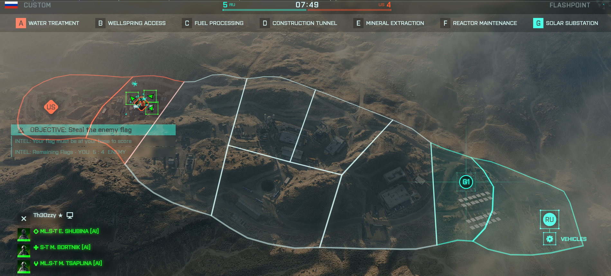

<!-- ### Breakaway (infantry only)

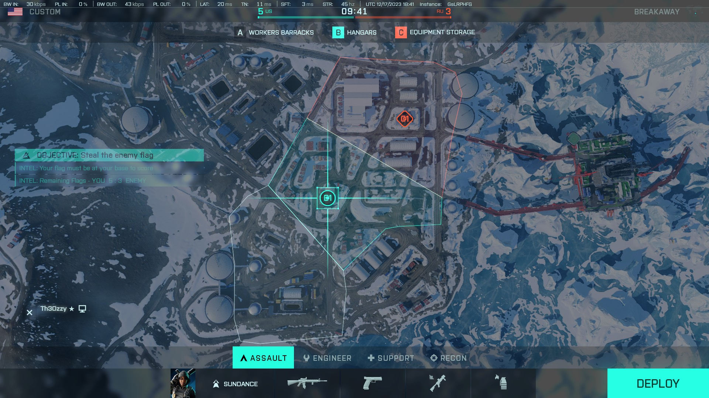 -->

### Spearhead (all out warfare)

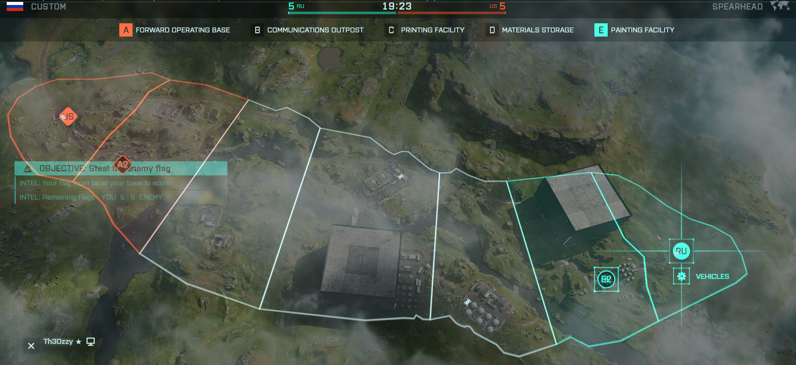

### Stranded (small) (infantry only)

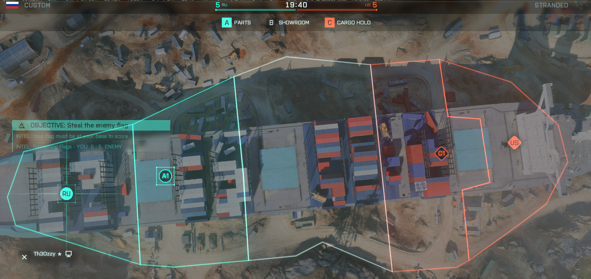

### Orbital (all out warfare)

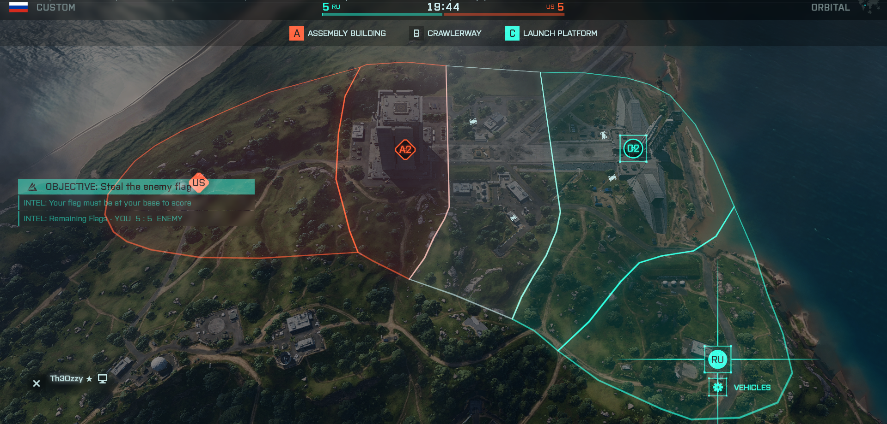

### Arica Harbor (small) (infantry only)

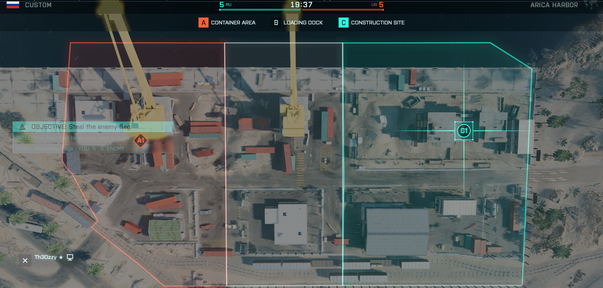

### Manifest (all out warfare)

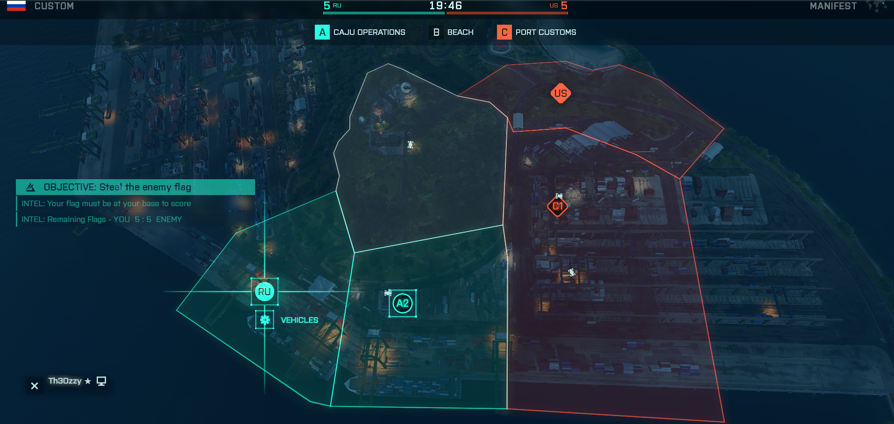

### Caspian Border (infantry only)

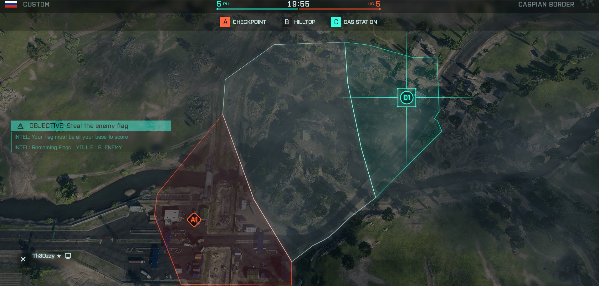

### Arica Harbor (large) (all out warfare)

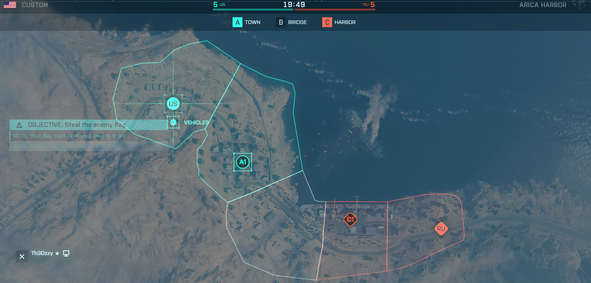

### Discarded (infantry only)

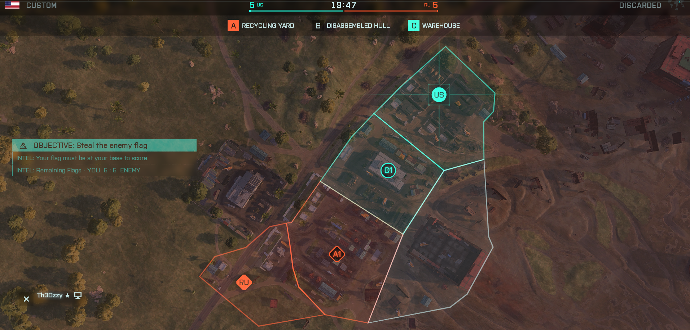

### Exposure (infantry only)

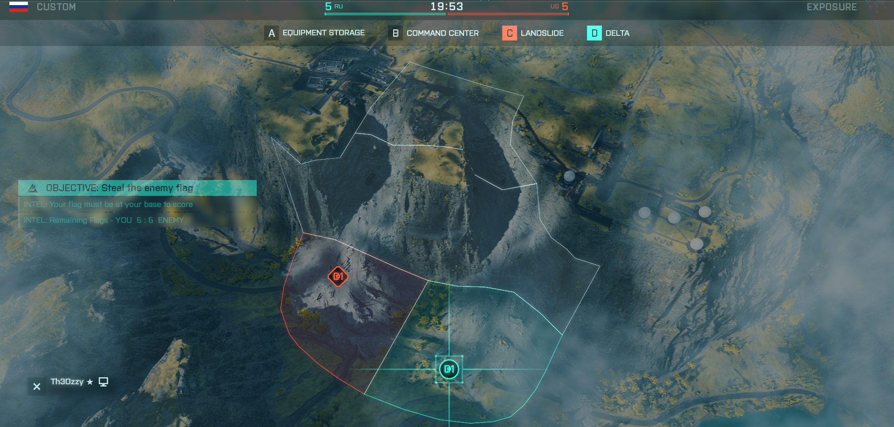

### Renewal (small) (infantry only)

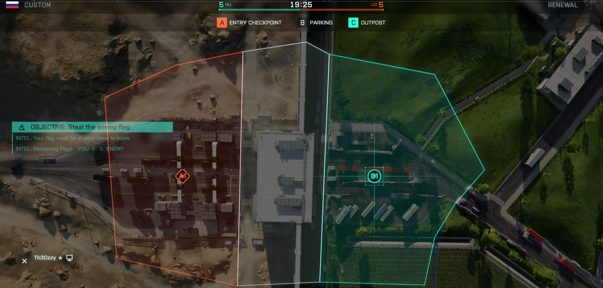

### Stranded (large) (all out warfare)

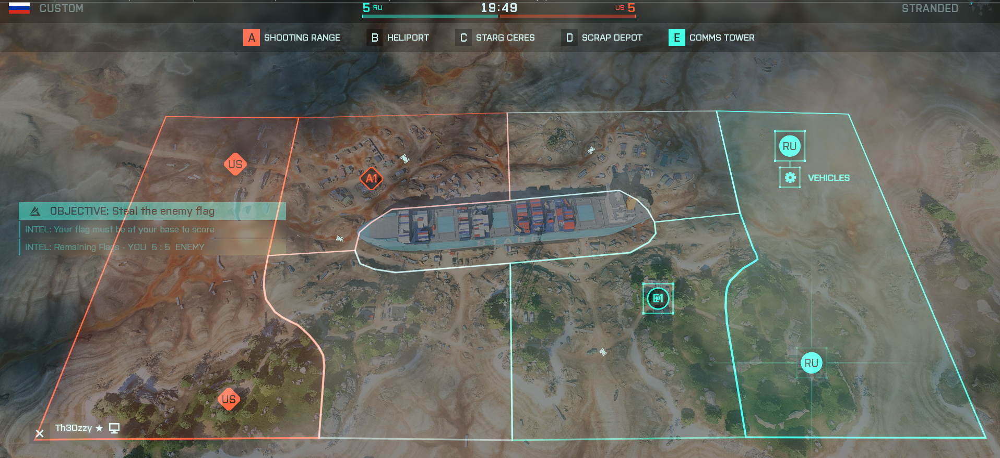

### Reclaimed (infantry only)

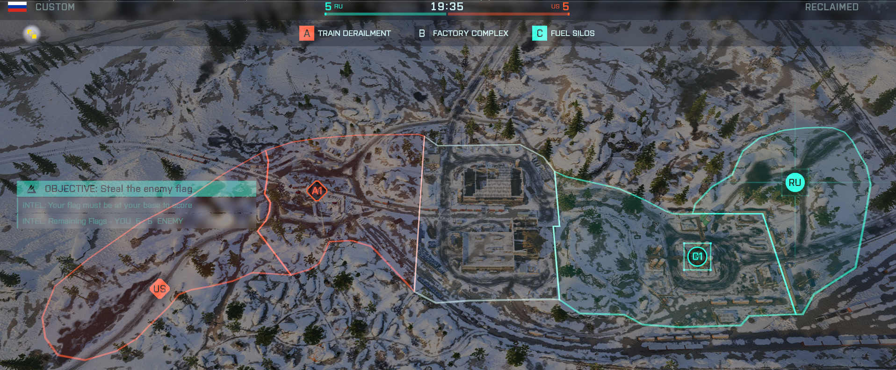

### Renewal (large) (all out warfare)

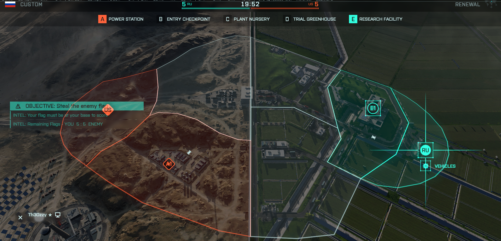

# Gameplay

## BF3 Trailer

[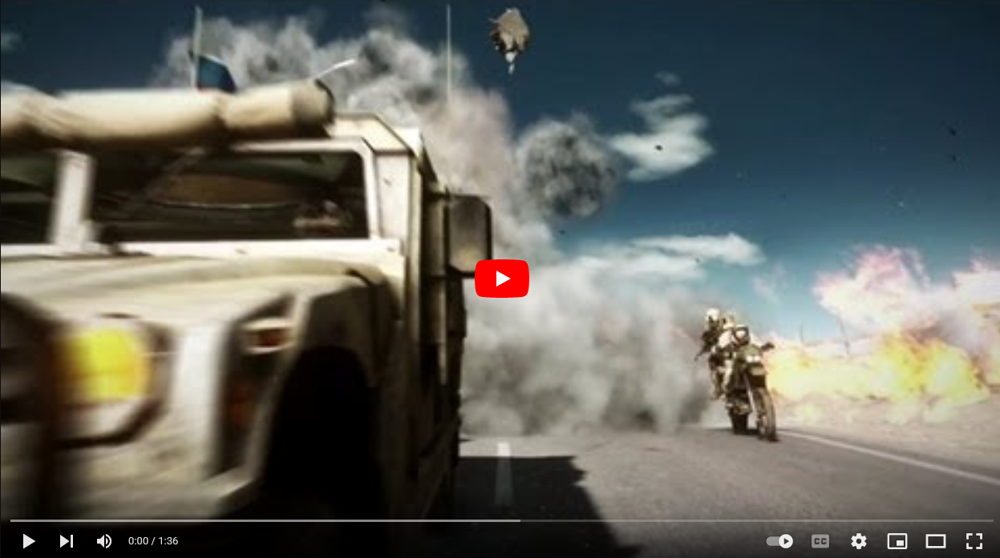](https://www.youtube.com/watch?v=wK5f7az5dIY)

## BF3 Gameplay

[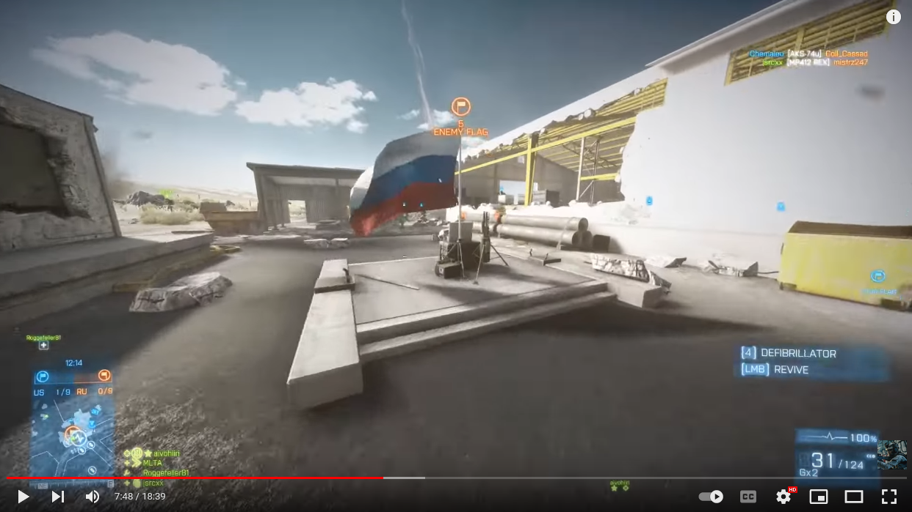](https://www.youtube.com/watch?v=Bed91jJ6-qw)

## 2042 Images

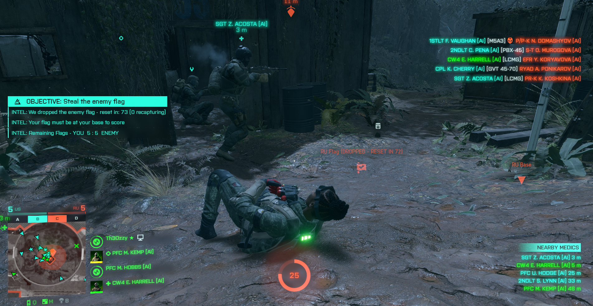

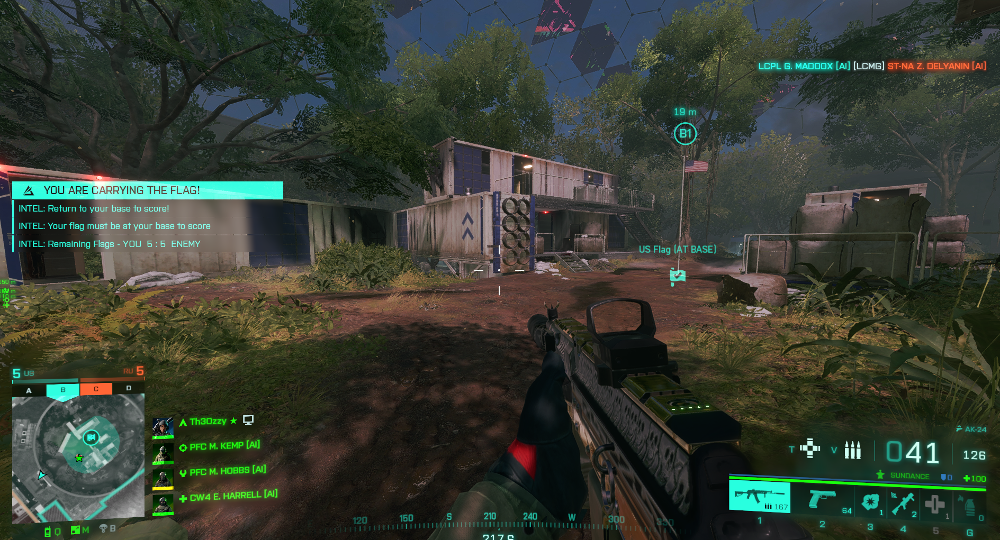

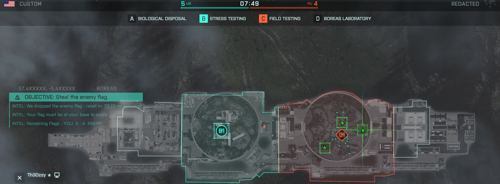
