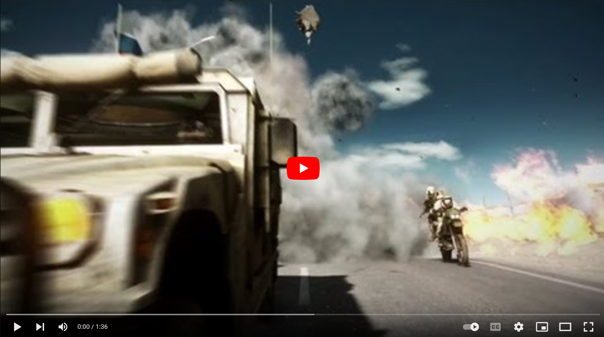
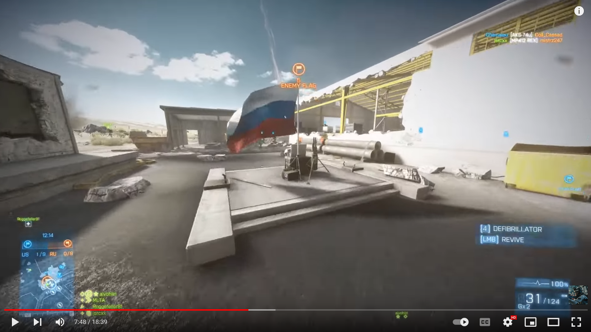

# BF2042 - Capture The Flag (based on BF3 End Game Extension)

## Experience Codes

* 2042 Version: `ABENTC`
* BF3 Version: `ABEWX7`

## Gameplay Rules

The OG CTF of BF3 - Get to the opposing flag to pick it up and carry it back to your base to score a point.  
To pickup or deliver a flag, the player must be on foot and not in a vehicle.  
If the flag carrier dies, the flag will be dropped at their current location.  
A dropped flag 
* can be picked up by the opposing team again
* will return to its base after a timeout (default: 60 seconds)
* can be returned faster by its owning team by standing close to it  
  reduce the timeout per tick: `timeout - (amount-of-players-within-10m * 0.02)`

The team scoring 5 points first, wins the match.  
In case of reaching the timelimit, the team with the most flag scores wins.

To score, the own flag must be at the base when delivering the enemy flag.

## Vehicle Restrictions

* 1x Main Battle Tank
* 4x Light transport Vehicles
* 2x Jet
* 2x Attack Helicopter
* 1x Heavy Transport Vehicle

## Map Layouts

### Flashpoint

### Spearhead

### Stranded

### Renewal

### Arica Harbor

# Gameplay

## Trailer

## Gameplay

